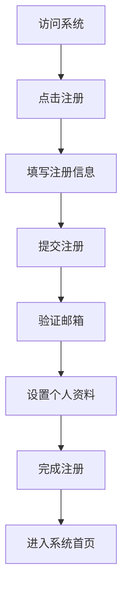
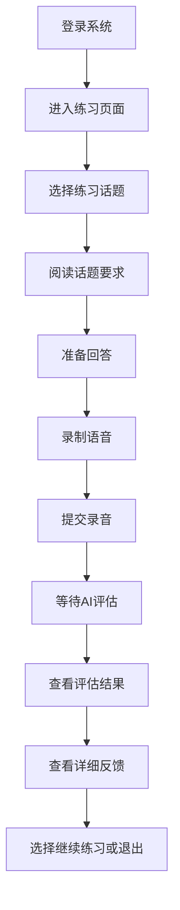
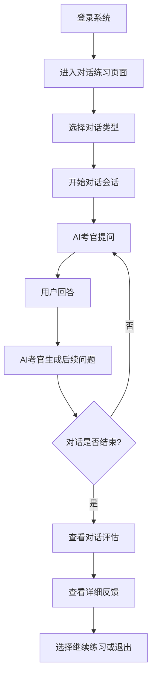
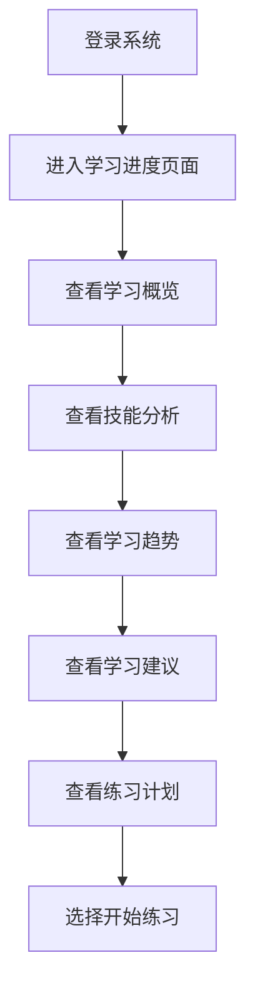

# 雅思口语练习系统产品功能文档

## 1. 产品概述

雅思口语练习系统是一个基于AI的智能口语练习平台，旨在帮助用户提高雅思口语水平，为考试做好充分准备。系统通过模拟真实的雅思口语考试环境，提供个性化的练习和评估，帮助用户识别自身优势和不足，有针对性地进行提升。

### 1.1 产品定位

- **目标市场**：准备参加雅思考试的学生和英语学习者
- **产品价值**：提供便捷、高效、个性化的口语练习体验，帮助用户快速提高口语水平
- **竞争优势**：AI驱动的实时评估和反馈，模拟真实考试环境，个性化学习路径

### 1.2 核心目标

- 帮助用户熟悉雅思口语考试流程和题型
- 提供专业的口语评估和反馈
- 跟踪用户学习进度，提供个性化学习建议
- 提升用户口语表达能力和自信心

## 2. 核心功能

### 2.1 功能模块

| 模块名称 | 功能描述 | 优先级 |
|---------|---------|--------|
| 用户管理 | 注册、登录、个人资料管理 | 高 |
| 口语练习 | 话题练习、语音录制、AI评估 | 高 |
| 对话练习 | 与AI考官对话、实时反馈 | 高 |
| 学习进度 | 进度跟踪、数据分析、学习报告 | 中 |
| 话题库 | 雅思口语话题分类、话题详情 | 中 |

### 2.2 详细功能描述

#### 2.2.1 用户管理

| 功能点 | 描述 | 用户场景 |
|-------|------|---------|
| 用户注册 | 支持邮箱和用户名注册，设置密码 | 新用户首次使用系统 |
| 用户登录 | 使用用户名和密码登录，支持JWT认证 | 用户需要访问个人学习数据 |
| 个人资料管理 | 查看和编辑个人信息，包括姓名、目标分数、英语水平等 | 用户需要更新个人信息 |
| 密码修改 | 修改登录密码，确保账户安全 | 用户需要更新密码 |
| 学习偏好设置 | 设置学习目标、偏好的练习类型等 | 用户希望个性化学习体验 |

#### 2.2.2 口语练习

| 功能点 | 描述 | 用户场景 |
|-------|------|---------|
| 话题选择 | 从话题库中选择练习话题，支持按难度和类型筛选 | 用户希望练习特定类型的话题 |
| 语音录制 | 录制口语回答，支持多次录制和重听 | 用户需要练习口语表达 |
| 语音转写 | 自动将录制的语音转换为文本 | 用户需要查看自己的回答内容 |
| AI评估 | 对口语回答进行多维度评估，包括流利度、发音、词汇、语法和连贯性 | 用户需要了解自己的口语水平 |
| 详细反馈 | 提供具体的改进建议和示例回答 | 用户需要针对性地提高口语能力 |
| 历史记录 | 查看历史练习记录和评估结果 | 用户需要跟踪学习进展 |

#### 2.2.3 对话练习

| 功能点 | 描述 | 用户场景 |
|-------|------|---------|
| 对话会话创建 | 创建与AI考官的对话练习会话 | 用户希望模拟真实的雅思口语考试 |
| 多部分练习 | 支持雅思口语考试的三个部分练习 | 用户需要全面准备考试 |
| 实时对话 | 与AI考官进行实时对话，AI根据用户回答生成后续问题 | 用户需要练习真实的对话场景 |
| 对话历史 | 查看完整的对话历史和AI反馈 | 用户需要回顾对话内容和改进方向 |
| 难度调整 | 根据用户水平自动调整对话难度 | 用户希望获得适合自己水平的练习 |

#### 2.2.4 学习进度

| 功能点 | 描述 | 用户场景 |
|-------|------|---------|
| 学习概览 | 查看总练习时间、总会话数、平均分等统计数据 | 用户需要了解整体学习情况 |
| 技能分析 | 分析用户在流利度、发音、词汇、语法和连贯性等方面的表现 | 用户需要了解自己的优势和不足 |
| 学习趋势 | 展示用户口语水平的变化趋势 | 用户需要了解自己的进步情况 |
| 学习建议 | 基于学习数据提供个性化的学习建议 | 用户需要有针对性地提高口语能力 |
| 练习计划 | 根据用户目标和当前水平生成练习计划 | 用户需要系统化地进行学习 |

#### 2.2.5 话题库

| 功能点 | 描述 | 用户场景 |
|-------|------|---------|
| 话题分类 | 按雅思口语考试的三个部分和话题类型进行分类 | 用户需要找到适合的练习话题 |
| 话题详情 | 查看话题描述、提示问题和相关词汇 | 用户需要了解话题要求和准备要点 |
| 热门话题 | 展示高频出现的雅思口语话题 | 用户需要重点准备常见话题 |
| 话题搜索 | 通过关键词搜索相关话题 | 用户需要快速找到特定话题 |

## 3. 用户流程

### 3.1 新用户注册流程

### 3.2 口语练习流程

### 3.3 对话练习流程

### 3.4 学习进度查看流程

## 4. 界面设计

### 4.1 设计风格

- **主色调**：蓝色和白色为主，象征专业和清新
- **辅助色**：橙色用于强调和交互元素
- **字体**：无衬线字体，清晰易读
- **布局**：简洁明了，重点突出，响应式设计
- **图标**：扁平化设计，直观易懂

### 4.2 主要页面

| 页面名称 | 功能描述 | 设计要点 |
|---------|---------|--------|
| 登录/注册页 | 用户认证入口 | 简洁的表单设计，清晰的操作指引 |
| 首页 | 系统概览和功能导航 | 卡片式布局，突出核心功能入口 |
| 练习页面 | 口语练习和对话练习 | 录音控件，话题展示，进度指示 |
| 评估结果页 | 展示口语评估结果 | 可视化评分，详细反馈，改进建议 |
| 学习进度页 | 展示学习数据和趋势 | 图表展示，数据可视化，个性化建议 |
| 个人中心页 | 用户资料和设置 | 个人信息管理，学习偏好设置 |
| 话题库页 | 浏览和搜索话题 | 分类导航，搜索功能，话题预览 |

### 4.3 响应式设计

- **桌面端**：完整功能，多列布局
- **平板端**：适配屏幕，保持核心功能
- **移动端**：简化界面，关注主要操作

## 5. 技术特点

### 5.1 AI驱动的评估系统

- **多维度评估**：从流利度、发音、词汇、语法和连贯性五个维度进行评估
- **实时反馈**：提供即时的评估结果和改进建议
- **个性化学习**：基于用户表现提供个性化的学习路径
- **自然语言处理**：使用先进的NLP技术分析口语表达

### 5.2 模拟真实考试环境

- **考试流程模拟**：完全模拟雅思口语考试的三个部分
- **AI考官**：模拟真实考官的提问和互动
- **时间限制**：严格按照考试时间要求进行练习
- **评分标准**：采用雅思官方评分标准进行评估

### 5.3 数据安全与隐私

- **数据加密**：敏感数据加密存储
- **隐私保护**：严格保护用户个人信息和学习数据
- **合规性**：符合数据保护法规要求

## 6. 应用场景

### 6.1 日常练习

- **适用人群**：正在准备雅思考试的学生
- **使用场景**：每天进行短时间的口语练习，保持口语能力
- **功能使用**：选择话题进行练习，查看评估结果，针对性改进

### 6.2 考前冲刺

- **适用人群**：即将参加雅思考试的学生
- **使用场景**：考试前集中进行模拟练习，熟悉考试流程
- **功能使用**：进行完整的对话练习，模拟真实考试环境，针对性强化薄弱环节

### 6.3 长期提升

- **适用人群**：希望长期提升英语口语能力的学习者
- **使用场景**：定期进行口语练习，跟踪学习进展
- **功能使用**：使用学习进度分析，制定个性化学习计划，持续提升口语能力

### 6.4 教师辅助

- **适用人群**：英语教师
- **使用场景**：为学生布置口语作业，查看学生练习情况
- **功能使用**：创建练习任务，查看学生评估结果，提供针对性指导

## 7. 未来规划

### 7.1 功能扩展

- **视频面试模拟**：模拟真实的视频面试场景
- **口语题库更新**：定期更新雅思口语话题库
- **社区功能**：用户之间的口语练习和交流
- **教师管理系统**：为教师提供更全面的学生管理功能

### 7.2 技术升级

- **更先进的AI模型**：使用更先进的AI模型提高评估准确性
- **多语言支持**：支持其他语言的口语练习和评估
- **离线功能**：支持离线练习和评估
- **VR/AR集成**：使用VR/AR技术提供更沉浸式的练习体验

### 7.3 市场扩展

- **国际市场**：拓展到全球市场，支持多语言界面
- **合作伙伴**：与教育机构和语言学校建立合作关系
- **企业培训**：为企业提供员工英语培训解决方案

## 8. 结论

雅思口语练习系统是一个功能完善、技术先进的智能口语练习平台，通过AI驱动的评估和模拟真实考试环境，为用户提供高效、个性化的口语练习体验。系统不仅可以帮助用户准备雅思考试，还可以长期提升英语口语能力，是英语学习者的理想工具。

通过不断的技术升级和功能扩展，雅思口语练习系统将持续为用户提供更优质的服务，帮助更多人实现英语口语的提升和雅思考试的成功。