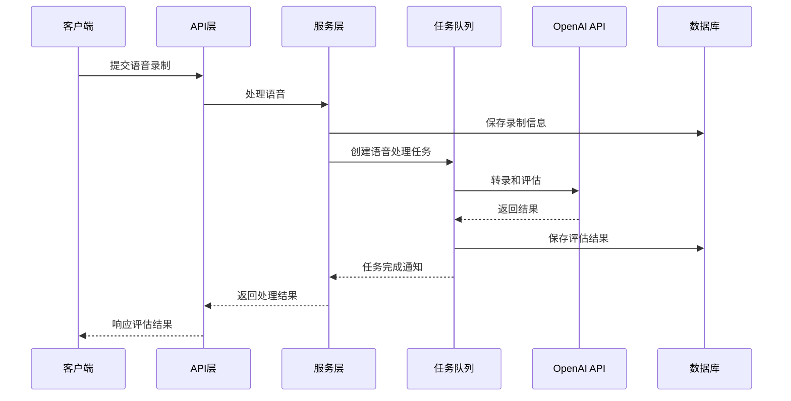
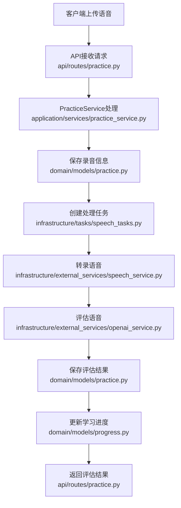
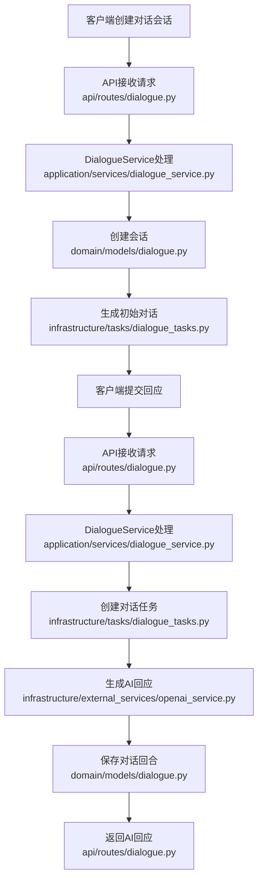
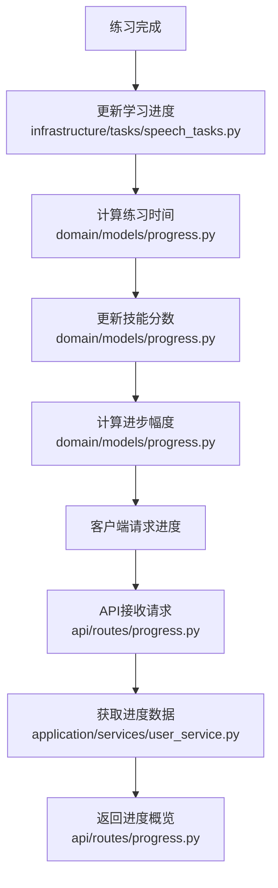

# 雅思口语练习API技术方案

## 1. 仓库分析

通过对仓库代码的分析，该项目是一个基于FastAPI的雅思口语练习API系统，采用了分层架构设计，包含以下主要组件：

### 1.1 项目结构

```
ielts_speaking_api/
├── api/                 # API层
│   ├── dependencies/    # 依赖项
│   ├── routes/          # 路由
│   └── main.py          # 主应用入口
├── domain/              # 领域模型
│   └── models/          # 数据模型
├── infrastructure/      # 基础设施
│   ├── database/        # 数据库
│   ├── external_services/ # 外部服务
│   └── tasks/           # 异步任务
├── application/         # 应用服务
│   └── services/        # 业务服务
├── shared/              # 共享配置
│   └── config/          # 配置
├── .env                 # 环境变量
└── .env.example         # 环境变量示例
```

### 1.2 核心功能模块

1. **用户认证模块**：实现用户注册、登录和JWT认证
2. **练习会话模块**：创建和管理口语练习会话
3. **语音处理模块**：处理语音录制、转录和评估
4. **对话练习模块**：实现与AI考官的对话练习
5. **学习进度模块**：跟踪和分析用户学习进度

### 1.3 技术栈

- **后端框架**：FastAPI
- **ORM**：SQLAlchemy
- **数据库**：SQLite
- **异步任务**：Celery
- **外部服务**：OpenAI API
- **认证**：JWT + HTTP Bearer

## 2. 后端系统技术方案

### 2.1. 技术选型

| 分类 | 技术 | 版本 | 选型理由 |
| :--- | :--- | :--- | :--- |
| 语言 | Python | 3.10+ | 简单易学，生态丰富，适合AI和Web开发 |
| 框架 | FastAPI | 最新版 | 高性能，自动生成API文档，类型提示支持 |
| 数据库 | SQLite | 最新版 | 轻量级，无需额外配置，适合开发和小型部署 |
| ORM | SQLAlchemy | 最新版 | 功能强大，支持多种数据库，对象关系映射 |
| 异步任务 | Celery | 最新版 | 分布式任务队列，支持异步处理长时间运行的任务 |
| 认证 | JWT | - | 无状态认证，便于水平扩展 |
| AI服务 | OpenAI API | - | 提供高质量的语音评估和对话生成能力 |

### 2.2. 关键设计

#### 2.2.1. 架构设计
- **架构风格**: 分层架构
- **模块划分**:
  - API层：处理HTTP请求和响应
  - 应用服务层：实现业务逻辑
  - 领域模型层：定义核心业务实体
  - 基础设施层：提供数据库、外部服务和任务处理

- **核心流程图**:



#### 2.2.2. 目录结构

```plaintext
ielts_speaking_api/       # 项目根目录
├── api/                   # API层
│   ├── dependencies/      # 依赖项（认证、数据库等）
│   │   ├── __init__.py
│   │   └── auth.py        # 认证相关依赖
│   ├── routes/            # 路由定义
│   │   ├── __init__.py
│   │   ├── auth.py        # 认证路由
│   │   ├── practice.py    # 练习路由
│   │   ├── dialogue.py    # 对话路由
│   │   ├── progress.py    # 进度路由
│   │   └── users.py       # 用户路由
│   └── main.py            # 主应用入口
├── domain/                # 领域模型
│   └── models/            # 数据模型定义
│       ├── __init__.py
│       ├── user.py        # 用户模型
│       ├── practice.py    # 练习相关模型
│       ├── dialogue.py    # 对话相关模型
│       └── progress.py    # 进度相关模型
├── infrastructure/        # 基础设施
│   ├── database/          # 数据库配置
│   │   └── database.py    # 数据库连接和会话管理
│   ├── external_services/ # 外部服务
│   │   ├── openai_service.py  # OpenAI服务
│   │   └── speech_service.py  # 语音处理服务
│   └── tasks/             # 异步任务
│       ├── __init__.py
│       ├── speech_tasks.py    # 语音处理任务
│       └── dialogue_tasks.py  # 对话处理任务
├── application/           # 应用服务
│   └── services/          # 业务服务
│       ├── user_service.py    # 用户服务
│       ├── practice_service.py # 练习服务
│       └── dialogue_service.py # 对话服务
├── shared/                # 共享配置
│   └── config/            # 配置
│       └── settings.py    # 应用设置
├── .env                   # 环境变量
└── .env.example           # 环境变量示例
```

* 说明：
  * `api/`（新增）：API层，处理HTTP请求和响应
  * `domain/models/`（新增）：领域模型，定义核心业务实体
  * `infrastructure/`（新增）：基础设施，提供数据库、外部服务和任务处理
  * `application/services/`（新增）：应用服务，实现业务逻辑
  * `shared/config/`（新增）：共享配置，管理应用设置

#### 2.2.3. 关键类与函数设计

| 类/函数名 | 说明 | 参数（类型/含义） | 成功返回结构/类型 | 失败返回结构/类型 | 所属文件/模块 | 溯源 |
|---------|------|----------------|----------------|----------------|-------------|------|
| `UserService.create_user()` | 创建用户 | username: str 用户名<br>email: str 邮箱<br>password: str 密码 | `User` 对象 | `ValueError` 异常 | application/services/user_service.py | 项目代码 |
| `PracticeService.create_practice_session()` | 创建练习会话 | user_id: int 用户ID<br>topic_id: int 话题ID | `PracticeSession` 对象 | `ValueError` 异常 | application/services/practice_service.py | 项目代码 |
| `PracticeService.process_speech_recording()` | 处理语音录制 | session_id: int 会话ID<br>file_path: str 文件路径 | 处理结果字典 | `ValueError` 异常 | application/services/practice_service.py | 项目代码 |
| `DialogueService.create_dialogue_session()` | 创建对话会话 | user_id: int 用户ID<br>topic_id: int 话题ID<br>session_type: str 会话类型 | `DialogueSession` 对象 | `ValueError` 异常 | application/services/dialogue_service.py | 项目代码 |
| `DialogueService.submit_user_response()` | 提交用户回应 | session_id: int 会话ID<br>user_input: str 用户输入 | 处理结果字典 | `ValueError` 异常 | application/services/dialogue_service.py | 项目代码 |
| `process_speech_recording` | 语音处理任务 | recording_id: int 录音ID<br>file_path: str 文件路径<br>language: str 语言代码 | 处理结果字典 | 错误信息字典 | infrastructure/tasks/speech_tasks.py | 项目代码 |
| `evaluate_speech` | 评估语音表现 | recording_id: int 录音ID<br>transcript: str 转录文本 | 评估结果字典 | 错误信息字典 | infrastructure/tasks/speech_tasks.py | 项目代码 |
| `generate_dialogue_response` | 生成对话回应 | session_id: int 会话ID<br>user_input: str 用户输入<br>turn_number: int 回合数 | 对话回应字典 | 错误信息字典 | infrastructure/tasks/dialogue_tasks.py | 项目代码 |
| `get_current_user` | 获取当前用户 | db: Session 数据库会话<br>token: str JWT令牌 | `User` 对象 | `HTTPException` 异常 | api/dependencies/auth.py | 项目代码 |
| `get_current_active_user` | 获取当前活跃用户 | current_user: User 当前用户 | `User` 对象 | `HTTPException` 异常 | api/dependencies/auth.py | 项目代码 |

#### 2.2.4. 数据库与数据结构设计

- **数据库表结构**:

  **`users`表**
  | 字段名 | 数据类型 | 约束 | 描述 |
  | :--- | :--- | :--- | :--- |
  | `id` | `Integer` | `PRIMARY KEY, INDEX` | 用户ID |
  | `username` | `String(50)` | `UNIQUE, INDEX, NOT NULL` | 用户名 |
  | `email` | `String(100)` | `UNIQUE, INDEX, NOT NULL` | 邮箱 |
  | `hashed_password` | `String(100)` | `NOT NULL` | 哈希密码 |
  | `is_active` | `Integer` | `DEFAULT 1` | 是否活跃 |
  | `created_at` | `DateTime` | `DEFAULT CURRENT_TIMESTAMP` | 创建时间 |
  | `updated_at` | `DateTime` | `DEFAULT CURRENT_TIMESTAMP` | 更新时间 |

  **`user_profiles`表**
  | 字段名 | 数据类型 | 约束 | 描述 |
  | :--- | :--- | :--- | :--- |
  | `id` | `Integer` | `PRIMARY KEY, INDEX` | 资料ID |
  | `user_id` | `Integer` | `FOREIGN KEY, UNIQUE, NOT NULL` | 用户ID |
  | `full_name` | `String(100)` | | 全名 |
  | `avatar_url` | `String(255)` | | 头像URL |
  | `ielts_target_score` | `Integer` | | 目标分数 |
  | `english_level` | `String(20)` | | 英语水平 |
  | `learning_preferences` | `Text` | | 学习偏好 |
  | `created_at` | `DateTime` | `DEFAULT CURRENT_TIMESTAMP` | 创建时间 |
  | `updated_at` | `DateTime` | `DEFAULT CURRENT_TIMESTAMP` | 更新时间 |

  **`practice_topics`表**
  | 字段名 | 数据类型 | 约束 | 描述 |
  | :--- | :--- | :--- | :--- |
  | `id` | `Integer` | `PRIMARY KEY, INDEX` | 话题ID |
  | `title` | `String(200)` | `NOT NULL` | 话题标题 |
  | `description` | `Text` | | 话题描述 |
  | `category` | `String(50)` | | 分类 |
  | `difficulty_level` | `String(20)` | | 难度级别 |
  | `part_type` | `String(20)` | | 雅思口语部分 |
  | `follow_up_questions` | `Text` | | 跟进问题 |
  | `created_at` | `DateTime` | `DEFAULT CURRENT_TIMESTAMP` | 创建时间 |
  | `updated_at` | `DateTime` | `DEFAULT CURRENT_TIMESTAMP` | 更新时间 |

  **`practice_sessions`表**
  | 字段名 | 数据类型 | 约束 | 描述 |
  | :--- | :--- | :--- | :--- |
  | `id` | `Integer` | `PRIMARY KEY, INDEX` | 会话ID |
  | `user_id` | `Integer` | `FOREIGN KEY, NOT NULL` | 用户ID |
  | `topic_id` | `Integer` | `FOREIGN KEY, NOT NULL` | 话题ID |
  | `duration_seconds` | `Integer` | | 持续时间 |
  | `start_time` | `DateTime` | `DEFAULT CURRENT_TIMESTAMP` | 开始时间 |
  | `end_time` | `DateTime` | | 结束时间 |
  | `status` | `String(20)` | `DEFAULT 'in_progress'` | 状态 |
  | `created_at` | `DateTime` | `DEFAULT CURRENT_TIMESTAMP` | 创建时间 |
  | `updated_at` | `DateTime` | `DEFAULT CURRENT_TIMESTAMP` | 更新时间 |

  **`speech_recordings`表**
  | 字段名 | 数据类型 | 约束 | 描述 |
  | :--- | :--- | :--- | :--- |
  | `id` | `Integer` | `PRIMARY KEY, INDEX` | 录音ID |
  | `session_id` | `Integer` | `FOREIGN KEY, NOT NULL` | 会话ID |
  | `file_path` | `String(255)` | `NOT NULL` | 文件路径 |
  | `file_format` | `String(10)` | | 文件格式 |
  | `duration_seconds` | `Float` | | 持续时间 |
  | `size_bytes` | `Integer` | | 文件大小 |
  | `recording_order` | `Integer` | | 录音顺序 |
  | `created_at` | `DateTime` | `DEFAULT CURRENT_TIMESTAMP` | 创建时间 |

  **`assessments`表**
  | 字段名 | 数据类型 | 约束 | 描述 |
  | :--- | :--- | :--- | :--- |
  | `id` | `Integer` | `PRIMARY KEY, INDEX` | 评估ID |
  | `recording_id` | `Integer` | `FOREIGN KEY, UNIQUE, NOT NULL` | 录音ID |
  | `overall_score` | `Float` | | 总分 |
  | `fluency_score` | `Float` | | 流利度分数 |
  | `pronunciation_score` | `Float` | | 发音分数 |
  | `vocabulary_score` | `Float` | | 词汇分数 |
  | `grammar_score` | `Float` | | 语法分数 |
  | `coherence_score` | `Float` | | 连贯性分数 |
  | `transcript` | `Text` | | 转录文本 |
  | `assessment_json` | `Text` | | 评估详细数据 |
  | `created_at` | `DateTime` | `DEFAULT CURRENT_TIMESTAMP` | 创建时间 |

  **`feedback_items`表**
  | 字段名 | 数据类型 | 约束 | 描述 |
  | :--- | :--- | :--- | :--- |
  | `id` | `Integer` | `PRIMARY KEY, INDEX` | 反馈ID |
  | `assessment_id` | `Integer` | `FOREIGN KEY, NOT NULL` | 评估ID |
  | `category` | `String(50)` | | 反馈类别 |
  | `description` | `Text` | | 反馈描述 |
  | `suggestion` | `Text` | | 建议 |
  | `severity` | `String(20)` | | 严重程度 |
  | `created_at` | `DateTime` | `DEFAULT CURRENT_TIMESTAMP` | 创建时间 |

  **`dialogue_sessions`表**
  | 字段名 | 数据类型 | 约束 | 描述 |
  | :--- | :--- | :--- | :--- |
  | `id` | `Integer` | `PRIMARY KEY, INDEX` | 会话ID |
  | `user_id` | `Integer` | `FOREIGN KEY, NOT NULL` | 用户ID |
  | `topic_id` | `Integer` | `FOREIGN KEY` | 话题ID |
  | `session_type` | `String(20)` | | 会话类型 |
  | `difficulty_level` | `String(20)` | | 难度级别 |
  | `status` | `String(20)` | `DEFAULT 'active'` | 状态 |
  | `total_turns` | `Integer` | | 总回合数 |
  | `start_time` | `DateTime` | `DEFAULT CURRENT_TIMESTAMP` | 开始时间 |
  | `end_time` | `DateTime` | | 结束时间 |
  | `created_at` | `DateTime` | `DEFAULT CURRENT_TIMESTAMP` | 创建时间 |
  | `updated_at` | `DateTime` | `DEFAULT CURRENT_TIMESTAMP` | 更新时间 |

  **`dialogue_turns`表**
  | 字段名 | 数据类型 | 约束 | 描述 |
  | :--- | :--- | :--- | :--- |
  | `id` | `Integer` | `PRIMARY KEY, INDEX` | 回合ID |
  | `session_id` | `Integer` | `FOREIGN KEY, NOT NULL` | 会话ID |
  | `turn_number` | `Integer` | | 回合数 |
  | `speaker` | `String(20)` | | 发言者 |
  | `content` | `Text` | | 内容 |
  | `created_at` | `DateTime` | `DEFAULT CURRENT_TIMESTAMP` | 创建时间 |

  **`learning_progress`表**
  | 字段名 | 数据类型 | 约束 | 描述 |
  | :--- | :--- | :--- | :--- |
  | `id` | `Integer` | `PRIMARY KEY, INDEX` | 进度ID |
  | `user_id` | `Integer` | `FOREIGN KEY, UNIQUE, NOT NULL` | 用户ID |
  | `total_practice_time_seconds` | `Integer` | | 总练习时间 |
  | `total_sessions` | `Integer` | | 总会话数 |
  | `total_dialogues` | `Integer` | | 总对话数 |
  | `average_score` | `Float` | | 平均分 |
  | `last_practice_date` | `DateTime` | | 最后练习日期 |
  | `streak_days` | `Integer` | | 连续练习天数 |
  | `fluency_improvement` | `Float` | | 流利度进步 |
  | `pronunciation_improvement` | `Float` | | 发音进步 |
  | `vocabulary_improvement` | `Float` | | 词汇进步 |
  | `grammar_improvement` | `Float` | | 语法进步 |
  | `coherence_improvement` | `Float` | | 连贯性进步 |
  | `skill_breakdown` | `Text` | | 技能细分 |
  | `created_at` | `DateTime` | `DEFAULT CURRENT_TIMESTAMP` | 创建时间 |
  | `updated_at` | `DateTime` | `DEFAULT CURRENT_TIMESTAMP` | 更新时间 |

- **数据传输对象 (DTOs)**:

  ```python
  # 用户注册请求
  class UserRegister(BaseModel):
      username: str
      email: str
      password: str

  # 用户登录请求
  class UserLogin(BaseModel):
      username: str
      password: str

  # 登录响应
  class Token(BaseModel):
      access_token: str
      token_type: str

  # 练习会话创建请求
  class PracticeSessionCreate(BaseModel):
      topic_id: int

  # 语音录制请求
  class SpeechRecordingCreate(BaseModel):
      session_id: int
      file_path: str
      language: str = "en-US"

  # 对话会话创建请求
  class DialogueSessionCreate(BaseModel):
      topic_id: Optional[int] = None
      session_type: str = "general"
      difficulty_level: str = "medium"

  # 用户回应请求
  class UserResponseCreate(BaseModel):
      session_id: int
      user_input: str
      audio_path: Optional[str] = None
  ```

| 配置项 | 类型 | 默认值 | 说明 | 所属文件/模块 | 类型 | 溯源 |
| ----------- | ----- | --- | ------ | ------------ |----| -------- |
| `APP_NAME` | str | "IELTS Speaking API" | 应用名称 | shared/config/settings.py | 新增 | 项目代码 |
| `APP_VERSION` | str | "1.0.0" | 应用版本 | shared/config/settings.py | 新增 | 项目代码 |
| `API_V1_STR` | str | "/api/v1" | API版本前缀 | shared/config/settings.py | 新增 | 项目代码 |
| `SECRET_KEY` | str | "your-secret-key" | JWT密钥 | shared/config/settings.py | 新增 | 项目代码 |
| `ALGORITHM` | str | "HS256" | JWT算法 | shared/config/settings.py | 新增 | 项目代码 |
| `ACCESS_TOKEN_EXPIRE_MINUTES` | int | 30 | 访问令牌过期时间 | shared/config/settings.py | 新增 | 项目代码 |
| `DATABASE_URL` | str | "sqlite:///./ielts_speaking.db" | 数据库URL | shared/config/settings.py | 新增 | 项目代码 |
| `CELERY_BROKER_URL` | str | "redis://localhost:6379/0" | Celery broker URL | shared/config/settings.py | 新增 | 项目代码 |
| `CELERY_RESULT_BACKEND` | str | "redis://localhost:6379/0" | Celery结果后端 | shared/config/settings.py | 新增 | 项目代码 |
| `OPENAI_API_KEY` | str | "your-openai-api-key" | OpenAI API密钥 | shared/config/settings.py | 新增 | 项目代码 |

#### 2.2.4. API 接口设计

| API路径 | 方法 | 模块/文件 | 类型 | 功能描述 | 请求体 (JSON) | 成功响应 (200 OK) |
| :--- | :--- | :--- | :--- | :--- | :--- | :--- |
| `/api/v1/auth/register` | `POST` | `api/routes/auth.py` | `Router` | 用户注册 | `{"username": "testuser", "email": "test@example.com", "password": "password123"}` | `{"id": 1, "username": "testuser", "email": "test@example.com"}` |
| `/api/v1/auth/login` | `POST` | `api/routes/auth.py` | `Router` | 用户登录 | `{"username": "testuser", "password": "password123"}` | `{"access_token": "token", "token_type": "bearer"}` |
| `/api/v1/auth/me` | `GET` | `api/routes/auth.py` | `Router` | 获取当前用户信息 | N/A | `{"id": 1, "username": "testuser", "email": "test@example.com"}` |
| `/api/v1/practice/topics` | `GET` | `api/routes/practice.py` | `Router` | 获取练习话题列表 | N/A | `[{"id": 1, "title": "Describe a place", "category": "daily life"}]` |
| `/api/v1/practice/sessions` | `POST` | `api/routes/practice.py` | `Router` | 创建练习会话 | `{"topic_id": 1}` | `{"id": 1, "topic_id": 1, "status": "in_progress"}` |
| `/api/v1/practice/sessions/{session_id}` | `GET` | `api/routes/practice.py` | `Router` | 获取练习会话详情 | N/A | `{"id": 1, "topic_id": 1, "status": "in_progress", "recordings": [...]}` |
| `/api/v1/practice/recordings` | `POST` | `api/routes/practice.py` | `Router` | 上传语音录制 | `{"session_id": 1, "file_path": "/path/to/audio.mp3"}` | `{"recording_id": 1, "transcript": "Hello...", "assessment_task_id": "task_id"}` |
| `/api/v1/practice/assessments/{assessment_id}` | `GET` | `api/routes/practice.py` | `Router` | 获取评估结果 | N/A | `{"id": 1, "overall_score": 7.5, "fluency_score": 8.0, "feedback_items": [...]}` |
| `/api/v1/dialogue/sessions` | `POST` | `api/routes/dialogue.py` | `Router` | 创建对话会话 | `{"topic_id": 1, "session_type": "part1"}` | `{"id": 1, "topic_id": 1, "session_type": "part1"}` |
| `/api/v1/dialogue/sessions/{session_id}` | `GET` | `api/routes/dialogue.py` | `Router` | 获取对话会话详情 | N/A | `{"id": 1, "topic_id": 1, "turns": [...]}` |
| `/api/v1/dialogue/sessions/{session_id}/response` | `POST` | `api/routes/dialogue.py` | `Router` | 提交用户回应 | `{"user_input": "I think..."}` | `{"session_id": 1, "task_id": "task_id", "status": "processing"}` |
| `/api/v1/dialogue/tasks/{task_id}` | `GET` | `api/routes/dialogue.py` | `Router` | 获取对话任务状态 | N/A | `{"status": "completed", "result": {"ai_response": "That's a good point..."}}` |
| `/api/v1/progress/overview` | `GET` | `api/routes/progress.py` | `Router` | 获取学习进度概览 | N/A | `{"total_practice_time_minutes": 120, "average_score": 7.0, "skill_improvement": {...}}` |
| `/api/v1/progress/history` | `GET` | `api/routes/progress.py` | `Router` | 获取学习历史记录 | N/A | `{"period": "week", "history": [...]}` |
| `/api/v1/progress/analytics` | `GET` | `api/routes/progress.py` | `Router` | 获取学习分析数据 | N/A | `{"has_data": true, "average_scores": {...}, "progress": {...}}` |
| `/api/v1/users/me` | `GET` | `api/routes/users.py` | `Router` | 获取用户资料 | N/A | `{"id": 1, "username": "testuser", "profile": {...}}` |
| `/api/v1/users/me` | `PUT` | `api/routes/users.py` | `Router` | 更新用户资料 | `{"full_name": "Test User", "ielts_target_score": 8}` | `{"id": 1, "username": "testuser", "profile": {...}}` |

#### 2.2.5. 主业务流程与调用链

**1. 语音评估流程**



**2. 对话练习流程**



**3. 学习进度跟踪流程**



## 3. 部署与集成方案

### 3.1. 依赖与环境

| 依赖 | 版本/范围 | 用途 | 安装命令 | 所属文件/配置 |
| :--- | :--- | :--- | :--- | :--- |
| `fastapi` | `^0.104.1` | Web框架 | `pip install fastapi` | requirements.txt |
| `uvicorn[standard]` | `^0.24.0` | ASGI服务器 | `pip install "uvicorn[standard]"` | requirements.txt |
| `sqlalchemy` | `^2.0.23` | ORM | `pip install sqlalchemy` | requirements.txt |
| `python-jose[cryptography]` | `^3.3.0` | JWT库 | `pip install "python-jose[cryptography]"` | requirements.txt |
| `passlib[bcrypt]` | `^1.7.4` | 密码哈希 | `pip install "passlib[bcrypt]"` | requirements.txt |
| `python-multipart` | `^0.0.6` | 表单数据处理 | `pip install python-multipart` | requirements.txt |
| `celery` | `^5.3.4` | 异步任务队列 | `pip install celery` | requirements.txt |
| `redis` | `^5.0.1` | Celery broker | `pip install redis` | requirements.txt |
| `openai` | `^1.3.5` | OpenAI API | `pip install openai` | requirements.txt |
| `python-dotenv` | `^1.0.0` | 环境变量管理 | `pip install python-dotenv` | requirements.txt |
| `pydantic` | `^2.5.0` | 数据验证 | `pip install pydantic` | requirements.txt |
| `pydantic-settings` | `^2.1.0` | 配置管理 | `pip install pydantic-settings` | requirements.txt |

### 3.3. 集成与启动方案

- **配置文件 (` .env`)**:

  ```dotenv
  # 应用配置
  APP_NAME="IELTS Speaking API"
  APP_VERSION="1.0.0"
  API_V1_STR="/api/v1"

  # 安全配置
  SECRET_KEY="your-secret-key-here"
  ALGORITHM="HS256"
  ACCESS_TOKEN_EXPIRE_MINUTES=30

  # 数据库配置
  DATABASE_URL="sqlite:///./ielts_speaking.db"

  # Celery配置
  CELERY_BROKER_URL="redis://localhost:6379/0"
  CELERY_RESULT_BACKEND="redis://localhost:6379/0"

  # OpenAI配置
  OPENAI_API_KEY="your-openai-api-key-here"
  ```

- **启动脚本 (`start.sh`)**:

  ```bash
  #!/bin/bash

  # 启动Redis（如果需要）
  # redis-server &

  # 启动Celery worker
  celery -A infrastructure.tasks.speech_tasks worker --loglevel=info --detach

  # 启动应用服务器
  uvicorn api.main:app --host 0.0.0.0 --port 8000 --reload
  ```

- **编译与运行命令**:

  ```bash
  # 安装依赖
  pip install -r requirements.txt

  # 启动应用
  bash start.sh
  ```

### 4. 代码安全性

#### 4.1. 注意事项

1. **敏感信息泄露**：环境变量中的API密钥和密码等敏感信息可能被意外泄露。
2. **SQL注入**：使用原始SQL查询时可能存在SQL注入风险。
3. **认证与授权**：未正确实现认证和授权机制可能导致未授权访问。
4. **跨站请求伪造(CSRF)**：未实现CSRF保护可能导致恶意请求。
5. **跨站脚本(XSS)**：未对用户输入进行适当处理可能导致XSS攻击。
6. **密码存储**：不安全的密码存储方式可能导致密码泄露。
7. **API速率限制**：未实现速率限制可能导致DoS攻击。
8. **依赖包安全**：使用有安全漏洞的依赖包可能导致安全问题。

#### 4.2. 解决方案

1. **敏感信息保护**：
   - 使用环境变量存储敏感信息，避免硬编码
   - 确保.env文件不被提交到版本控制系统
   - 使用pydantic-settings管理配置，提供默认值和类型验证

2. **SQL注入防护**：
   - 使用SQLAlchemy ORM进行数据库操作，避免原始SQL
   - 如需使用原始SQL，使用参数化查询
   - 对用户输入进行验证和过滤

3. **认证与授权**：
   - 使用JWT进行无状态认证
   - 实现基于角色的访问控制
   - 对敏感操作进行权限检查

4. **CSRF保护**：
   - 实现CSRF令牌验证
   - 对修改操作使用POST/PUT/DELETE方法
   - 设置适当的CORS策略

5. **XSS防护**：
   - 对用户输入进行HTML转义
   - 使用Content-Security-Policy头
   - 验证和清理用户输入

6. **密码安全**：
   - 使用passlib进行密码哈希
   - 实现密码强度检查
   - 定期提醒用户更新密码

7. **API速率限制**：
   - 实现基于IP的速率限制
   - 对敏感接口设置更严格的限制
   - 使用Redis存储速率限制计数器

8. **依赖包安全**：
   - 定期更新依赖包
   - 使用安全扫描工具检查依赖包
   - 锁定依赖包版本，避免自动更新导致的问题

9. **日志安全**：
   - 避免在日志中记录敏感信息
   - 实现日志级别控制
   - 定期轮换日志文件

10. **错误处理**：
    - 实现统一的错误处理机制
    - 避免向客户端暴露详细的错误信息
    - 记录错误日志以便排查问题